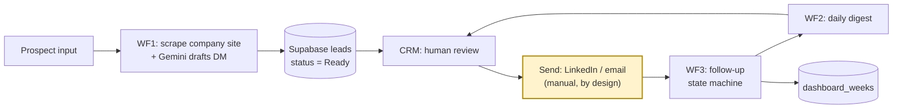
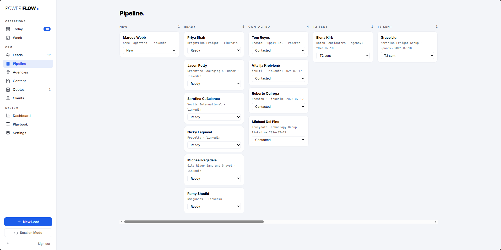
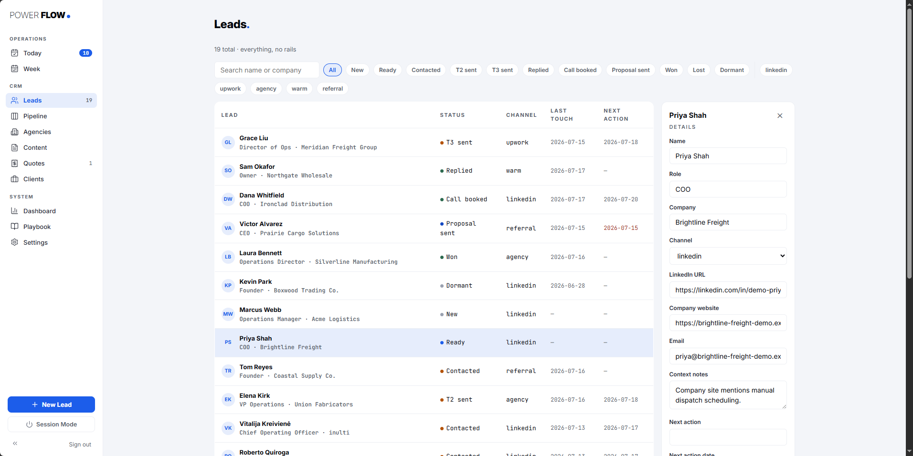
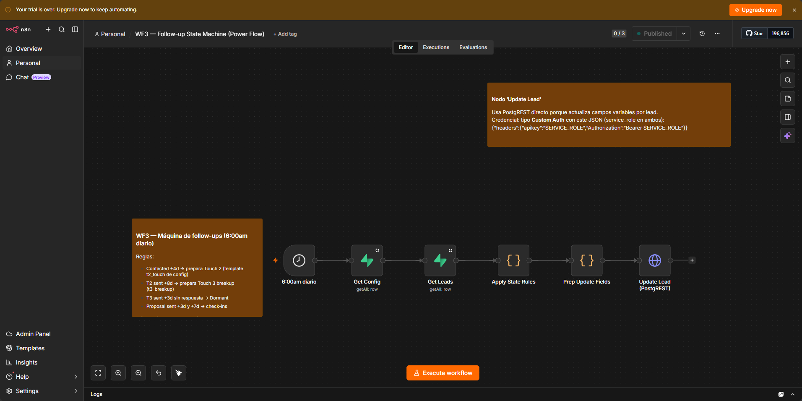
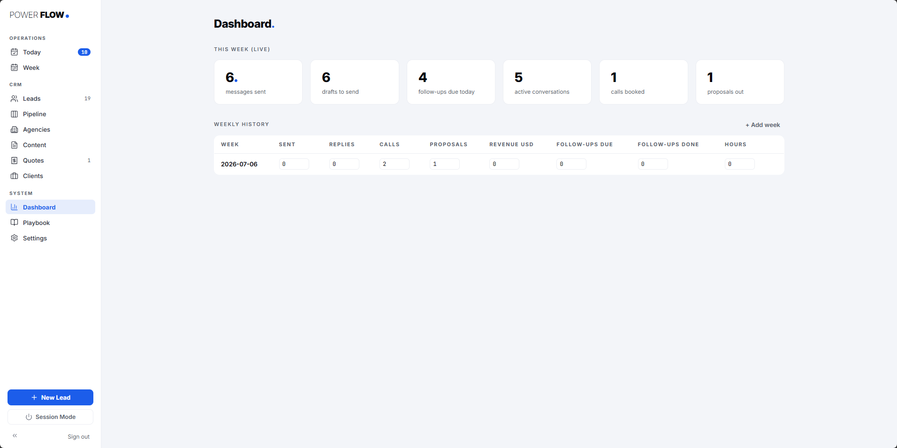
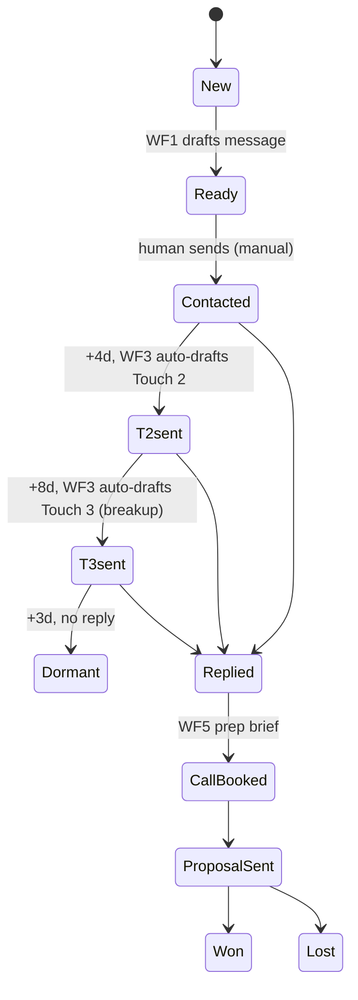

# Power Flow OS

**An outreach operating system for a solo automation agency: AI-drafted personalized messages, automated follow-up state machine, and a custom CRM — built on n8n, Supabase, Gemini, and React, running for ~$20/month total — $0 of that on AI.**

*[▶ Watch the 2-minute walkthrough](https://youtu.be/k36qqaFpKyE)*

*Yellow node = the one manual step in the pipeline. That's a compliance decision, not a gap — see [Trade-offs](#trade-offs-i-accepted) below.*

Full diagrams and component breakdown: [docs/architecture.md](docs/architecture.md).

---

## The business problem

Manual outreach for a solo agency costs about 6 minutes per personalized message — researching the prospect, writing something that isn't generic, then remembering to follow up. There was no follow-up system at all: leads went cold because nobody remembered to check back in 4 days, then 8, then 12. For a one-person, pre-revenue agency, that's not an efficiency problem. The cost of a dropped follow-up is the entire pipeline, because there's no second pipeline behind it.

## Constraints

- **~$20/month total SaaS budget, self-funded pre-revenue.** Every recurring cost — right now that's just n8n Cloud — has to be justified against a business that isn't paying for itself yet.
- **Maintainable solo.** No team to hand tooling off to — every workflow has to be something one person can debug at 11pm.
- **LinkedIn prohibits automating the send.** Automating outbound messages risks an account ban, and losing the account kills the primary channel outright. The "last mile" is manual by design — a risk decision, not a technical limitation.

## Options considered

| Decision | Chosen | Why |
|---|---|---|
| Zapier vs n8n | **n8n** | Self-hostable later, no per-task pricing ceiling, workflow logic is a JSON file that's versionable in git instead of locked in a vendor's UI. |
| Airtable vs Supabase | **Supabase** | Real Postgres underneath — SQL, joins, row-level security, a free PostgREST API. The CRM and the workflows share one database instead of syncing two. |
| Claude API vs Gemini 2.5 Flash (free tier) | **Gemini** | The plan was Claude. A billing block on the Anthropic key mid-build forced the question "what do I actually lose by switching?" — and the answer was almost nothing: the integration is plain HTTP with prompts stored in `config`, so switching providers is a one-node edit, not a rewrite. Every draft passes human review before it sends, which caps the quality risk. $0/month vs. an estimated $3–6/month at full volume. Marked permanent 2026-07-09; revisited if volume or the draft edit-rate says otherwise. |
| Native n8n AI nodes vs HTTP Request node | **HTTP Request** | Native AI nodes lag behind on model support and lock the workflow to one provider. Plain HTTP gives exact control over the request body — and it's exactly what made the Gemini pivot a 10-minute change instead of a blocker. |
| CRM SaaS (HubSpot free, Pipedrive) vs custom CRM | **Custom CRM** | Power Flow's pipeline doesn't map cleanly onto a generic SaaS CRM's stages. The custom CRM reads the same Supabase tables the workflows write to — one source of truth, not two systems drifting apart. |

Full reasoning for each, ADR-style: [docs/decisions.md](docs/decisions.md).

## Architecture

Three layers, one database. **n8n** is the workflow engine — six scheduled/triggered workflows that scrape, draft, follow up, and digest. **Supabase (Postgres)** is the single source of truth, read and written by both the automations (via `service_role`, bypassing RLS) and the CRM (via authenticated user sessions). **The CRM** (React + Vite + TypeScript, deployed on Vercel) is the human interface — pipeline board, lead detail, dashboard — reading and writing the same tables n8n touches, so there's never a sync step to break.

Full breakdown of each n8n workflow, the data model, and the state machine diagram: [docs/architecture.md](docs/architecture.md).

### Screenshots

| Pipeline board | Lead detail — AI draft |
|---|---|
|  |  |

| WF3 in n8n | Weekly dashboard |
|---|---|
|  |  |

## The follow-up state machine

This is the piece that's actually worth showing in an interview.

Every transition after "Contacted" is a cron job deciding what happens next, not a person. WF3 runs once a day, checks days-since-last-touch against a fixed rule set, and either drafts the next message from a template in `config` or marks the lead `Dormant`. WF2 packages whatever's due into a single email at 7:25pm. The only decision left for a human at night is "send this, or don't" — nothing to plan, nothing to remember. Notably, WF3 doesn't call an LLM at all: it's deterministic find-and-replace against pre-written templates. AI only shows up where it earns its cost (drafting the first-touch message); the state machine itself is intentionally boring. `Dormant` is currently a resting state, not a dead end — see [What I'd do differently / next](#what-id-do-differently--next).

## Trade-offs I accepted

- **Manual last-mile send.** I chose LinkedIn ToS compliance over speed — automating the send risks the account, and the account is the channel.
- **n8n cloud instead of self-hosted.** I'm trading roughly $20/month for time I don't have yet. Revisit once volume justifies running my own instance.
- **Gemini Flash free tier instead of a paid frontier model.** I accepted a lower quality ceiling in exchange for $0/month, mitigated by the fact that no draft ships without a human reading it first. The day review starts requiring heavy edits, switching providers is a one-node change, not a redesign.
- **No automated tests on the workflows.** At this volume and blast radius, test coverage isn't where the risk is — a human reviewing every single draft before it sends is the actual control.

## Results (honest)

The business is pre-revenue, and this case study says so without flinching — inflated numbers are worth less than an honest one.

- **Cycle time per message:** timed directly, 3 messages each way — ~6 minutes manual (research + writing) down to ~2 minutes (review + send).
- **Reliability:** confirmed via n8n Executions — WF3 ran daily in production without missing a run from July 10 through July 16, 2026, when the n8n trial expired and paused all workflows. Upgrade to the paid Starter plan (the $20/month already reflected in the cost table below) is in progress to resume. Zero decisions required at night when it's running, only execution.
- **Build time:** ~1 week of nights, verifiable in git history — first commit July 4, 2026, 14 commits through July 10.
- **Revenue / outreach volume:** not yet. The pipeline hasn't run at real volume, so drafts-generated and follow-ups-triggered counts from `activities` are left out here on purpose rather than reported at near-zero and dressed up as a result. Revenue attribution comes next, once there's a pipeline's worth of real leads to attribute it to.

## What I'd do differently / next

- **Code the Dormant +60-day resurface rule in WF3.** It was in the original spec and the `dormant_resurface` template already exists in `config`, but the rule never got wired into WF3's logic — right now a `Dormant` lead stays there until someone manually resurfaces it. Small gap, on the list.
- **Activate WF5** (discovery prep brief) once real calls start booking. It's built ahead of its own gate on purpose and sits idle until there's a call to prep for.
- **Self-host n8n** once volume passes the point where the $20/month it currently costs buys back less time than running the instance would take.
- **Add evals on draft quality** once there's enough review history to know what "good" actually looks like, instead of guessing at a rubric now.
- **Revisit the Gemini/Claude decision** if the free tier's quality ceiling ever becomes the actual bottleneck — the switch is designed to be cheap on purpose.

## Stack summary + cost

| Layer | Tool | Monthly cost |
|---|---|---|
| AI drafting | Gemini 2.5 Flash (free tier) | $0 |
| Workflow engine | n8n Cloud (Starter) | ~$20 |
| Database | Supabase | $0 (free tier) |
| CRM hosting | Vercel | $0 (free tier) |
| **Total** | | **~$20/month** |

For reference: the Claude plan originally scoped (`claude-opus-4-8`, $5/M input tokens, $25/M output tokens) was estimated at ~$3–6/month at full volume before the billing block forced the Gemini pivot. That number was calculated and weighed, not skipped — the AI line staying at $0 is a comparison, not an assumption. The $20/month total is entirely n8n; every other layer runs on a free tier.
