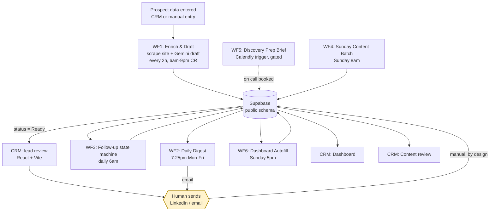
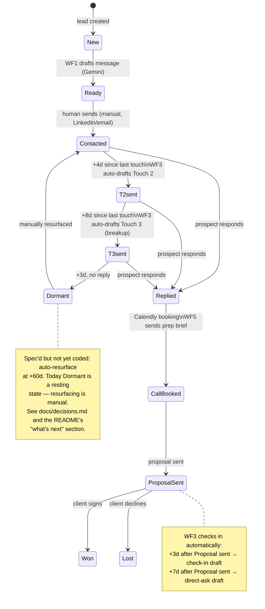
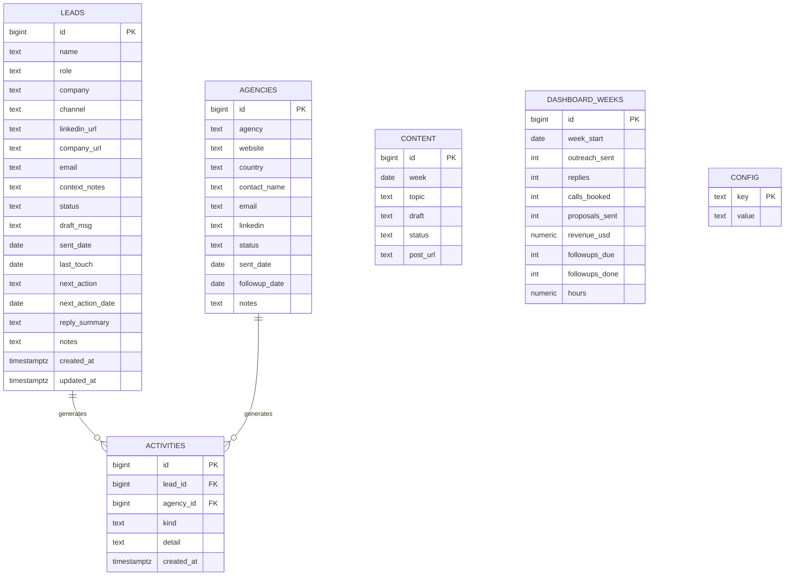

# Architecture

Three views of the same system: how data flows through it end to end, how a single lead moves through the follow-up state machine, and how the underlying tables relate to each other.

---

## 1. System architecture

Supabase is the hub, not n8n and not the CRM — every workflow and every CRM page reads and writes the same tables, so there's no sync step anywhere in this diagram to fall out of date. The one yellow node is the only manual step in the entire loop: a human copying a drafted message and hitting send on LinkedIn or email. That's not a missing automation, it's a deliberate stop — see [ADR-006](decisions.md#adr-006-manual-last-mile-send-instead-of-automating-linkedin-outreach). WF5 is drawn with a dashed line because it's gated behind the first real discovery call and currently idle — built ahead of schedule, waiting for volume to justify activating it.

---

## 2. Follow-up state machine

This is the most defensible piece of the system in an interview, because every arrow after `Contacted` is a cron job deciding what happens next, not a person remembering to follow up. WF3 runs once a day, computes days-since-last-touch for every lead, and matches it against a fixed rule set: 4 days of silence after first contact drafts Touch 2, 8 more days drafts the breakup message, 3 more days of nothing marks the lead `Dormant`. A won or lost proposal isn't the end of the automation either — WF3 keeps checking in at +3 and +7 days with no reply. None of this calls an LLM: the drafts come from fixed templates in `config` with placeholders (`{{first_name}}`, `{{company}}`) filled in by find-and-replace. AI only runs where it earns its cost — the first-touch message, which actually needs to sound specific to the prospect. The state machine is intentionally boring, and that's the point: boring is what makes it trustworthy enough to run unattended every morning at 6am.

---

## 3. Data model

The one design decision worth explaining here: `activities` is an append-only event log, not a mirror of `leads.status`. Status is mutable — it gets overwritten every time a lead moves stages, so by the time Sunday's dashboard job runs, there's no way to reconstruct "how many replies came in this week" from status alone. `activities` logs each meaningful event (`sent`, `reply_received`, `call_booked`, `proposal_sent`, `followup_done`, ...) as an immutable row the moment it happens. WF6 aggregates `activities` by `kind` for the week and upserts one row into `dashboard_weeks`, keyed on `week_start` so re-running the job never double-counts. `config` is business config (offer text, follow-up templates) that n8n reads at runtime — editing copy there never means editing a workflow. Full reasoning: [ADR-007](decisions.md#adr-007-an-events-table-activities-instead-of-reading-status-snapshots-for-metrics).

*The diagram shows the outreach core. Two app-internal tables — `weekly_reviews` (weekly retro notes from the CRM's Sunday ritual) and `settings` (CRM app config, distinct from `config` which is business config read by n8n) — are omitted here for clarity but included in the published [schema.sql](../supabase/schema.sql).*
